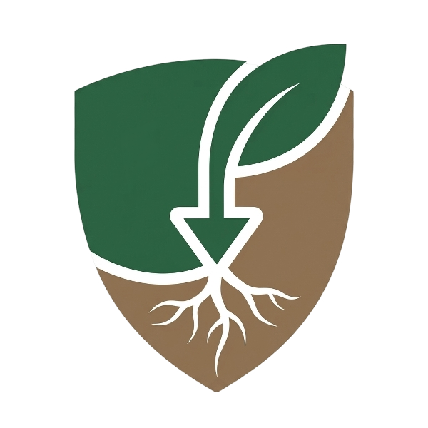
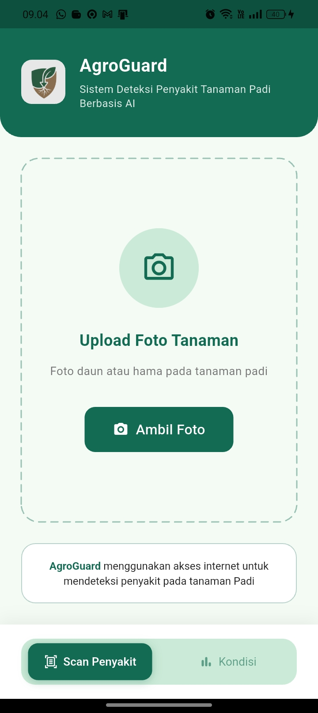
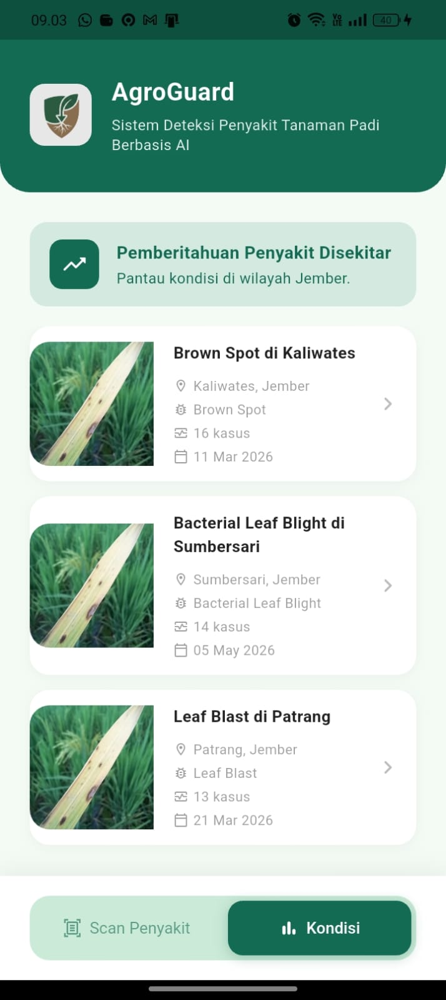
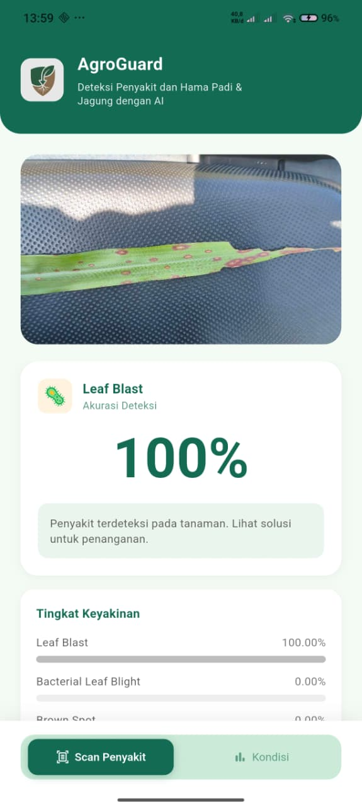

  
  <h1>🌾 AgroGuard Mobile 📱</h1>
  
<em>Protecting crops through smart image and location-based tracking.</em>

  
  
  
  

---

## 📖 About The Project

**AgroGuard Mobile** is the mobile client for the comprehensive AgroGuard ecosystem. Designed for field use, this Flutter application allows users to capture images of crops, automatically attach geolocation data, compress images for efficient data usage, and securely upload them to the AgroGuard Laravel backend for further analysis and visualization on the admin dashboard.

## ✨ Features

- 📸 **Smart Image Capture**: Easily capture photos of plants or crops directly from the app.
- 📍 **Geolocation Tracking**: Automatically tags images with precise GPS coordinates.
- 🗜️ **Efficient Image Compression**: Reduces upload time and saves data bandwidth.
- 🔗 **Backend Integration**: Seamlessly communicates with the Laravel backend via robust APIs.
- 🔐 **Environment Configuration**: Secure environment variable management for API keys and endpoints.
- 🎨 **Modern UI/UX**: Clean, responsive, and material-design-inspired interface with custom icons and splash screens.

## 🛠️ Tech Stack

- **Framework**: [Flutter](https://flutter.dev/)
- **Language**: [Dart](https://dart.dev/)
- **Key Packages**:
  - `image_picker` (Camera & Gallery access)
  - `geolocator` (GPS & Location services)
  - `flutter_image_compress` (On-device image optimization)
  - `http` (API requests)
  - `flutter_dotenv` (Environment variable management)
  - `permission_handler` (Runtime permissions management)

## 🚀 Getting Started

Follow these steps to get a local copy up and running.

### Prerequisites

- Flutter SDK (^3.10.1 or higher)
- Dart SDK
- Android Studio / Xcode (for emulation/building)
- AgroGuard Backend Server (Laravel) running locally or hosted

## 📱 Screenshots

   &nbsp;
   &nbsp;
  

## 🤝 Contributing

Contributions, issues, and feature requests are welcome! Feel free to check the [issues page](https://github.com/Darah0/AgroGuard/issues).

## 📄 License

Distributed under the MIT License. See `LICENSE` for more information.

---

  <i>Built with ❤️ by the AgroGuard Team for a greener future.</i>

